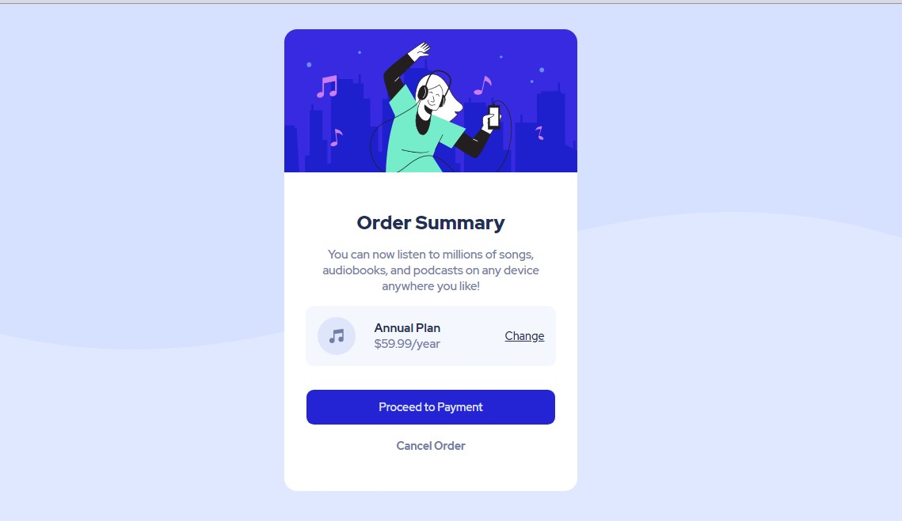
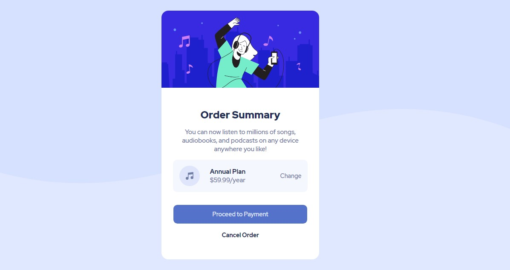

# Frontend Mentor - Order summary card solution

This is a solution to the [Order summary card challenge on Frontend Mentor](https://www.frontendmentor.io/challenges/order-summary-component-QlPmajDUj).

## Table of contents

- [Overview](#overview)
  - [The challenge](#the-challenge)
  - [Screenshot](#screenshot)
  - [Links](#links)
  - [Built with](#built-with)
  - [What I learned](#what-i-learned)
  - [Useful resources](#useful-resources)
- [Author](#author)

## Overview

### The challenge

Users should be able to:

- See hover states for interactive elements

### Screenshot

### Links

- Live Site : --> [click here:-)](https://brave-tesla-3d9bb7.netlify.app/)

### Built with

- Semantic HTML5 markup
- CSS custom properties
- Flexbox

### What I learned

I learned lot of things from this challange.

### Useful resources

- [w3schools](https://www.w3schools.com) - I really liked this pattern and will use it going forward.
- [geeks for geeks](https://www.geeksforgeeks.org) - This is an amazing article which I'd recommend it to anyone still learning this concept.
- [tutorials-point](https://www.tutorialspoint.com) - Everthing that you need to build projects.

## Author

- Frontend Mentor - [@Sandesh4141](https://www.frontendmentor.io/profile/Sandesh4141)
- Twitter - [@sandesh-sp](https://www.twitter.com/@Sandesh32971351)
- Instagram - [@sandesh.sp41](https://www.instagram.com/sandesh.sp41)
- 
